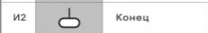
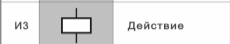
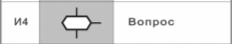
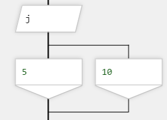

# Иконы для реализации 

## Заголовок / title

### Варианты содержимого:
Название функции
```javascript
function functionName(){
    return undefined;
}
```


## Конец / end

### Варианты содержимого
Комментарий к последнему оператору
```javascript
function functionName(){
    // my scheme return
    return undefined;
}
```


## действие / action

### Варианты содержимого:  
1. объявления переменных и констант
 ```javascript
var letter = 'a'
let letter = 'b'
const x = 5
```   
2. Операции над данными
```javascript
letter = 'a' + 'b' // 'ab'
// all arithmetic
x = x - 5 
// icrement/decrement
х--
// all assignment operators
х /= y
// all bitwise operators
x = 5 | 1
// return operators
return x;
```

## Вопрос / if

### Варианты содержимого:  
Все условные варианты
 ```javascript
x > 5
// после трансляции становится
if (x > 5) {

} else {
    
}
```
Если условия вложены:
```javascript
if (x > 5) {

} else {
 if (y == x) {

 } else {

 }   
}
```
Цикл / while  
  
(Подумать как реализовать различие IF и WHILE)


## Вариант / switch

### Варианты содержимого:  
Все условные варианты
 ```javascript
// после трансляции становится
switch (j) 
{
    case 5:
        break;
    case 10:
        break;
    default:
        throw new NotImplementedException();
}
```

## Простой ввод / input

### Варианты содержимого:  
 ```javascript
// первой строкой
const readline = require('readline')
...

...
j = readline()
```


## Простой вывод / output

### Варианты содержимого:  
 ```javascript
// первой строкой
const readline = require('readline')
...

...
console.log(j)
```

## Пауза / sleep

### Варианты содержимого:  
 ```javascript
// первой строкой
sleep(2000)
```


## Комментарий / comment

### Варианты содержимого:  
 ```javascript
// содержимое комментария
```
